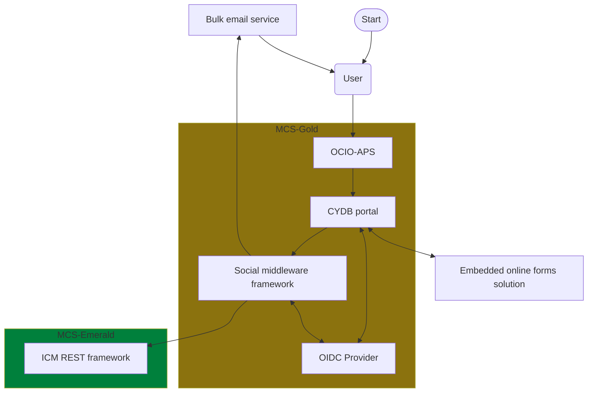

Additional information:

- **MCS-Gold**: Managed Container Services - Private Cloud Gold Tier
- **MCS-Emerald**: Managed Container Services - Private Cloud Emerald Tier
- [ICM REST framework](https://dev.azure.com/bc-icm/SiebelCRM%20Lab/_wiki/wikis/SiebelCRM-Lab.wiki/575/Siebel-Application-Client-ID-(Service-Account)-Operation-for-DATA-API)
- [Social middleware framework - GitHub repo](https://github.com/bcgov/social-middleware)