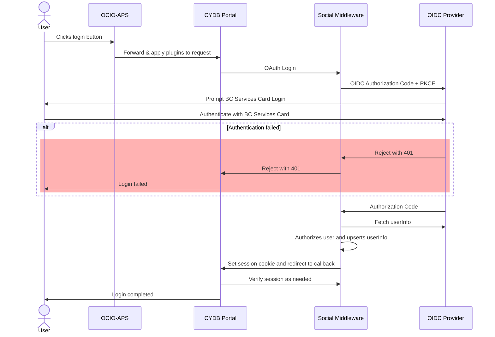

```mermaid
sequenceDiagram
    actor User
    participant portalProxy as OCIO-APS
    participant portal as CYDB Portal
    participant middle as Social Middleware
    participant idBroker as OIDC Provider

    User->>portalProxy: Clicks login button
    portalProxy->>portal: Forward & apply plugins to request
    portal->>middle: OAuth Login
    middle->>idBroker: OIDC Authorization Code + PKCE
    idBroker->>User: Prompt BC Services Card Login
    User->>idBroker: Authenticate with BC Services Card

    alt Authentication failed
        rect rgba(255, 0, 0, 0.3)
            idBroker->>middle: Reject with 401
            middle->>portal: Reject with 401
            portal->>User: Login failed
        end
    end

    idBroker->>middle: Authorization Code
    middle->>idBroker:Fetch userInfo
    middle->>middle: Authorizes user and upserts userInfo
    middle->>portal: Set session cookie and redirect to callback
    portal->>middle: Verify session as needed
    portal->>User: Login completed
```

